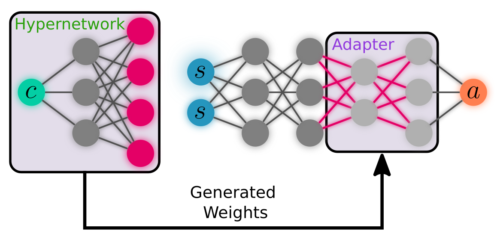

# Decision Adapter
- [Decision Adapter](#decision-adapter)
  - [About](#about)
  - [File Structure](#file-structure)
  - [Getting Started](#getting-started)
    - [Mujoco](#mujoco)
    - [Running Files](#running-files)
  - [Reproduction](#reproduction)
    - [Prerequisites](#prerequisites)
    - [Experiments](#experiments)
    - [Analysis](#analysis)


## About
This project introduces the *Decision Adapter*, a neural network architecture designed to improve generalisation in reinforcement learning. In general, we use a *hypernetwork* to generate weights for a part of our main policy's neural network. This hypernetwork is conditioned on the *context*, a vector that represents certain aspects of the current task.


## File Structure
The file structure of this project is as follows:
```
src                                             -> Where all of the source is
├── common                                      -> Some general utils
└── runs                                        -> 
    └── v0200/v0200.py                          -> The main run file
├── genrlise                                    -> 
│   ├── envs                                    -> The environment definitions we use
│   ├── analyse                                 -> General code relevant to analysis
│   ├── rlanalyse                               -> Additional analysis code
│   ├── utils                                   -> More utilities
│   ├── common                                  -> Common utilities
│   │   └── networks                            ->
│   │   │   └── segmented_adapter.py            -> The Hypernetwork Adapter architecture
│   ├── contexts                                -> General code for working with contexts
│   │   ├── context_encoder.py                  -> 
│   │   ├── context_sampler.py                  -> 
│   │   └── problem.py                          -> 
│   └── methods                                 -> The code for each of the methods
│       ├── base                                -> 
│       ├── clean                               -> This contains most of the code
│       │   └── sac                             -> 
│       │   │   ├── clean_sac_adapter_v1.py     -> The Decision Adapter method
│       │   │   └── base_clean_sac.py           -> The training code for all methods
│       └── hyper                               -> Some training utilities
```
## Getting Started
You can create the environment as follows:
```
conda env create -f env.yml
conda activate DA
```
We've found that this conda approach works, but we've also included the pip requirements file as sometimes that works better.

E.g.,
```
conda create -n DA python=3.9 pip=21.2.4 setuptools=58.0.4
conda activate DA
pip install -r requirements.txt
```

We note that the environment worked on Ubuntu 22.04 and 20.04 with CUDA 11.3. You may need to change the packages in `env.yml` to match your CUDA version, or alternatively change the CUDA version to match the one in `env.yml`.

### Mujoco
Also, install Mujoco (e.g. using the instructions [here](https://github.com/openai/mujoco-py/)).

In particular, we had to run the following
```bash
sudo apt install libosmesa6-dev libgl1-mesa-glx libglfw3
```

And we added the required license key to the correct location (e.g. `~/.mujoco/mjkey.txt`). 

In addition to this, we've found that we had to delete `~/anadonda3/envs/DA/lib/libstdc++.so*` for mujoco to work properly.

### Running Files
Then, to run any Python file in this repository, please use `./run.sh /path/to/file.py` instead of using Python directly. Furthermore, run everything from the root of the repository.
## Reproduction

This section specifies how to reproduce our results. In particular, the training must first be run, followed by the analysis code. Each training experiment is referred to by an experiment number, for instance `v0601a-aa3`. Here, this will be experiment `v0601a`, and setting/method/algorithm `aa3`. This experiment will then correspond to a yaml configuration file in `artifacts/config/v020x_benchmarks/v0801/v0801-a1.yaml`, which defines the type of experiment to run.
To run this experiment, one can run 
```bash
./exp.sh v0601a-aa3 <slurm partition>
```
If you want to run the code locally, you can use

```bash
./exp.sh v0601a-aa3 dummy False False True
```


Note, to ensure out of memory errors do not occur, the code is set to run only one training seed at a time. If you want to run multiple seeds in parallel (which will be faster), you can remove the `--override-cores=1` inside `exp.sh`.

### Prerequisites
This codebase is based on a Slurm cluster, but it can also be run locally. Inside `src/genrlise/common/vars.py`, the `ROOT_DIR` function must be changed to accurately reflect the root path of this repository, either locally or on the Slurm-based cluster.

```python
def ROOT_DIR(is_local: bool):
    if is_local: 
        return '/path/to/this/repo'
    return '/path/to/this/repo'
```


### Experiments

<details>
<summary>
The following experiments must be run to obtain all of the results (click the arrow to see all of them).
</summary>

Here, when we write `v0601a`, it means all of the experiments must be run within this directory (except the `v0601a-_base.yaml` one). 
As an example, `v0601a` maps to the following commands:
```bash
./exp.sh v0601a-aa3
./exp.sh v0601a-bb3
./exp.sh v0601a-fb4
./exp.sh v0601a-u3
./exp.sh v0601a-x3
```

Next, we write the experiments that must be performed as follows:
- Experiment Name 1
  - Prerequisite 1
  - Prerequisite 2
  - ...


Therefore, we must run `Prerequisite 1`, then `Prerequisite 2` (in any order). Once both of these are completed, we can run `Experiment Name 1`.

#### ODE
These are the main ODE experiments
- `v0801a` (i.e. run `v0601a` and `v0701a` first before running `v0801a):
  - `v0601a`
  - `v0701a`
- `v0874b`:
  - `v0674b`
  - `v0774b`
#### Distractors - ODE
- `v1607_3b`
  - `v1607_2b`
- `v1707_3b`
  - `v1707_2b`
#### Distractors - CartPole
- `v0611b`
- `v0711b`
- `v1620_3b`:
  - `v1619_1b`
- `v1720_3b`:
  - `v1719_1b`
#### Distractors - Ant
- `v0527n`
- `v0727n`
- `v1788_11a`:
    - `v1578_1a`
- `v1788_11d`:
    - `v1578_1d`
- `v1788_11e`:
    - `v1578_1e`

- `v1789_11a`:
    - `v1579_1a`
- `v1789_11d`:
    - `v1579_1d`
- `v1789_11e`:
    - `v1579_1e`


#### Appendix Experiments
First run the above experiments before starting any of these. These experiments are the ones shown in the appendix.
##### ODE Positive/Negative
- `v0601f`
- `v0701f`
##### CartPole Noisy
- First these
  - `v0612b`
  - `v0612c`
  - `v0712b`
  - `v0712c`
- These
  - `v0851a`
  - `v0851b`
  - `v0851c`
  - `v0851d`
  - `v0851e`
  - `v0851f`
- Then these
  - `v0856a`
  - `v0856b`
  - `v0856c`
  - `v0856d`
  - `v0856e`
  - `v0856f`
- And these
  - `v0857a`
  - `v0857b`
  - `v0857c`
  - `v0857d`
  - `v0857e`
  - `v0857f`
##### ODE Norms
- `v0801b`:
    - `v0601b`
    - `v0701b`
- `v0801c`:
    - `v0601c`
    - `v0701c`
- `v0801d`:
    - `v0601d`
    - `v0701d`
- `v0801e`:
    - `v0601e`
    - `v0701e`
##### CP Norms
- `v0981c`
  - `v0681c`
  - `v0781c`
- `v0983a`:
    - `v0683a`
    - `v0783a`
- `v0983b`:
    - `v0683b`
    - `v0783b`
##### Different Context Setups

- `v0805a`
    - `v0605a`
    - `v0705a`
- `v0805b`
    - `v0605b`
    - `v0705b`
- `v0805c`
    - `v0605c`
    - `v0705c`
- `v0805d`
    - `v0605d`
    - `v0705d`
- `v0805e`
    - `v0605e`
    - `v0705e`
- `v0805f`
    - `v0605f`
    - `v0705f`
- `v0805g`
    - `v0605g`
    - `v0705g`
- `v0805h`
    - `v0605h`
    - `v0705h`

##### Gaussian Distractor Variables

- `v1608_3b`
  - `v1608_2b`
  - `v1608_9b`
- `v1609_3b`
   - `v1609_2b`
   - `v1609_9b`
- `v1708_3b`
   - `v1708_2b`
   - `v1708_9b`
- `v1709_3b`
   - `v1709_2b`
   - `v1709_9b`


##### Additional Adapter Ablations
- `v0861a`
  - `v0661a`
  - `v0761a`
- `v0861b`
  - `v0661b`
  - `v0761b`
- `v0861d`
  - `v0661d`
  - `v0761d`
- `v0861f`
  - `v0661f`
  - `v0761f`

</details>

### Analysis
After running the experiments, the analysis can be run using:
```bash
./run.sh src/analysis/progress/paper_plots/exp_results_a.py
./run.sh src/analysis/progress/paper_plots/exp_results_b.py
```
Then there should be a folder called `artifacts/results/progress/paper_plots_a/` and `artifacts/results/progress/paper_plots_b/` which contains all of the plots.